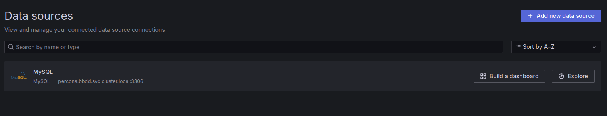
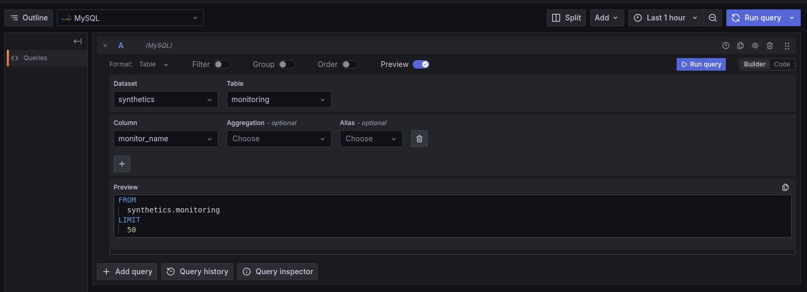
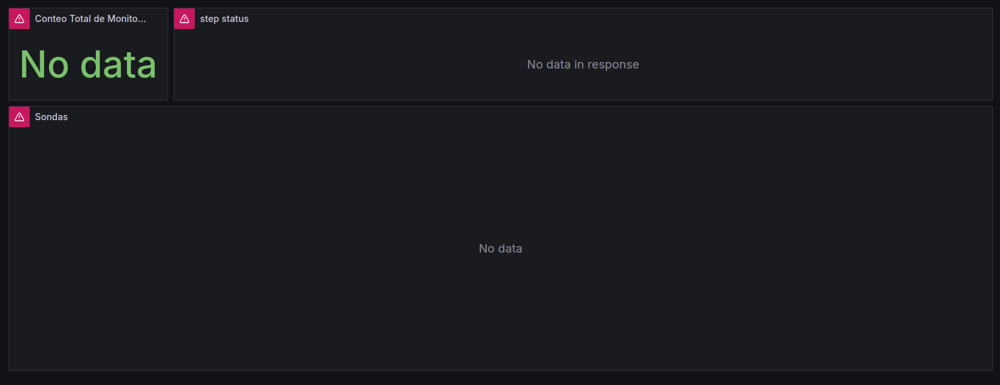
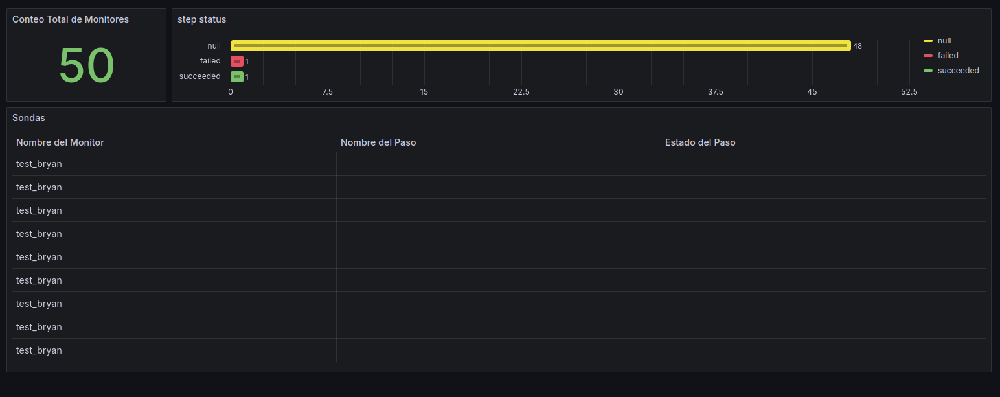

# PRUEBA DE CONOCIMIENTO TobeIT. 
## REQUISITOS
> Tener instalado Docker, minikube y Make para poder ejecutar el proyecto de forma automática.
## DATOS IMPORTANTES
Para automatizar el despliegue de este proyecto, he creado un Makefile donde he ido creando comandos según la necesidad.

Se puede lanzar

```
 make help
```
para visualizar la totalidad de comandos creados.

EN MI CASO LA IP DE MINIKUBE ES 192.168.49.2, EN CASO QUE SEA DIFERENTE, HAY QUE CAMBIAR ESTA IP SOLAMENTE EN EL SCRIPT DE PYTHON, EN EL APARTADO DE db_config.

* URL:
  * GRAFANA: IPMINUKUBE:32000
  * MYSQL:   IPMINUKUBE:30000
* CONTRASEÑAS:
  * USUARIO ADMIN GRAFANA: SecretP@assword
  * USUARIO GRAFANA MYSQL: SecretP@assword
  * USUARIO TOBEIT MYSQL:  SecretP@assword
  * USUARIO ROOT MYSQL:    P@ssw0rd

## Explicación del proyecto.

Este proyecto levanta un Grafana y un MYSQL. Grafana, está configurado para obtener y visualizar datos de dicha BBDD de forma automática, por otro lado. Los datos se obtienen de Elastic a través de un script en Python, donde acaba almacenando estos datos en la instancia de MYSQL.

Para poder levantar el proyecto entero, hay que ejecutar el siguiente comando

```shell
make build
```
### 1- Despliegue de un clúster de Minikube

Para este proyecto, he optado de levantar un Minikube básico, sin ningún plugin y configuración extra.

```shell
make run-minikube
```

Para comprobar que Minikube esté corriendo en mí máquina he creado un script básico, donde comprueba si el estado es Running, en caso contrario lanza un Make run-minikube para levantarlo.

```bash
	@if ! minikube status | grep -q "host: Running"; then \
		$(MAKE) run-minikube; \
	else \
		echo "Minikube ya está en ejecución."; \
	fi
``` 

Este script se puede ejecutar utilizando el siguiente comando:

```shell
make is-minikube-running
```

### 2- Dockerfile personalizado para Grafana

Para empezar, utilizo la imagen oficial como base de grafana 
en el cual incluyo la instalacion del plugin de percona, utilizando una variable de entorno

```Dockerfile
ENV GF_INSTALL_PLUGINS=percona-percona-app
```

Así mismo, también incluyo la configuración necesaria para que Grafana se pueda conectar a la BBDD y extraer los datos del mismo.

```yaml
apiVersion: 1

datasources:
- name: MySQL
  type: mysql
  url: percona.bbdd.svc.cluster.local:3306
  user: grafana
  jsonData:
    database: synthetics
    maxOpenConns: 100
    maxIdleConns: 100
    maxIdleConnsAuto: true
    connMaxLifetime: 14400
  secureJsonData:
    password: ${GRAFANA_MYSQL_PASSWORD}
```
Este fichero lo copio en la siguiente ruta:

```Dockerfile 

COPY ./Grafana/config/datasource.yml /etc/grafana/provisioning/datasources/datasource.yaml

```
De esta forma dejo esta imagen preparada para obtener datos de un MYSQL sin necesidad de configuraciones a posteriori, la mayoría de estos datos de configuración son estáticos, pero se podrían manejar con variables de entorno, pongo el ejemplo en la contraseña, ya que más adelante lo controlaré con un secret de Kubernetes.

Para construir dicha image docker he creado otro comando en el Makefile, donde previamente tengo que cambiar el backend de Docker para que utilice el de Minikube, ya que si no está imagen no será reconocida por Minikube, ha esta imagen la nombro con el nombre GRAFANA-PERSONALIZADO, con el tag latest utilizando una variable. 

```Makefile
docker-build-grafana: 
	@eval $$(minikube docker-env) && docker build -f ./Grafana/Dockerfile -t $(DOCKER_NAME_GRAFANA) .
```

## 3- Despliegue de Grafana y una Base de Datos (BBDD) en Minikube

Ahora que ya tengo una imagen de Grafana, procedo a la creación de otra imagen para la BBDD, en este caso utilizo la imagen base de percona, así mismo configuro unas variables de entorno para la creación de una BBDD llamada synthetics y el usuario tobeit.


```Dockerfile
ENV MYSQL_USER=tobeit \
    MYSQL_DATABASE=synthetics
```

Leyendo en la documentación de Grafana, recomiendan crear un usuario propio con solamente permisos de select, para evitar posibles problemas, es por ello que en esta misma imagen añado un init.sql, en el cual creo un usuario llamado Grafana y solo le doy permisos para realizar selecs en la BBDD synthetics, también aprovecho para dejar ya una estructura básica para poder almacenar los datos que recogeré posteriormente de elastic.

```sql
CREATE USER 'grafana'@'%' IDENTIFIED BY 'SecretP@assword';
GRANT SELECT ON synthetics.* TO 'grafana'@'%';
FLUSH PRIVILEGES;

CREATE TABLE monitoring (
    id VARCHAR(255) PRIMARY KEY,
    monitor_name VARCHAR(255),
    step_name VARCHAR(255),
    step_status VARCHAR(255),
    timestamp TIMESTAMP DEFAULT CURRENT_TIMESTAMP
);
```
La imagen oficial de Percona, permite ejecutar este init.sql al momento de iniciar el contenedor, para ello solamente tengo  que guardar este fichero en la ruta /docker-entrypoint-initdb.d/

```Dockerfile
COPY ./Mysql/files/init.sql /docker-entrypoint-initdb.d/init.sql

```
Teniendo ya las imágenes preparadas para este entorno, empiezo con la creación de los manifiestos de K8s para poder levantar ambas imagen en Kubernetes.

Para levantar Grafana en K8s, es bastante sencillo, ya que en la propia documentación te facilitan los manifiestos necesarios, en este caso parto de esta base, en la cual se puede encontrar en este [enlace](https://grafana.com/docs/grafana/latest/setup-grafana/installation/kubernetes/).

Lo primero que edito es el SERVICIO, ya que está en loadbalancer y como estamos en un clúster en local con minikube este tipo de servicio no es funcional sin ayuda de plugins externos, y como tampoco se ha configurado un ingress controller, cambio este servicio a nodePort, asignándole el puerto 32000, ya que sin una configuración previa de Kubernetes este no acepta puertos inferiores al 30000.


```yaml

apiVersion: v1
kind: Service
metadata:
  name: grafana
spec:
  ports:
  - port: 3000
    protocol: TCP
    targetPort: http-grafana
    nodePort: 32000
  selector:
    app: grafana
  type: NodePort

``` 
Lo siguiente que modifico es la imagen, ya que queremos usar la imagen personalizada que he creado anteriormente, dicha imagen la he nombrado grafana-personalizado:latest.


```yaml
    - name: grafana
        image: grafana-personalizado:latest
        imagePullPolicy: IfNotPresent
```
También he añadido un manifiesto para crear un secret
donde almaceno la contraseña del user admin de Grafana y el usuario del MySQL creado anteriormente para Grafana, para no exponer estas contraseñas en texto plano.

```yaml
apiVersion: v1
kind: Secret
metadata:
  name: grafana-conf
  namespace: grafana
type: Opaque
data:
  admin-password: U2VjcmV0UEBhc3N3b3Jk
  mysql-password: U2VjcmV0UEBhc3N3b3Jk
```
Luego en el propio deployment configuro las siguientes variables con las contraseñas anteriormente creadas.

```yaml
- name: GRAFANA_MYSQL_PASSWORD
          valueFrom:
            secretKeyRef:
              name: grafana-conf
              key: mysql-password
        - name: GF_SECURITY_ADMIN_PASSWORD
          valueFrom:
            secretKeyRef:
              name: grafana-conf
              key: admin-password
```

Para una mejor organización, he creado un namespace llamado Grafana, donde desplegaré el deployment de este mismo.

```yaml
apiVersion: v1
kind: Namespace
metadata:
  name: grafana
```

Por último, creo un PV para que los datos de configuración de Grafana sean persistentes.

```yaml

apiVersion: v1
kind: PersistentVolumeClaim
metadata:
  name: grafana-pvc
spec:
  accessModes:
  - ReadWriteOnce
  resources:
    requests:
      storage: 1Gi
``` 

Para poder deployar Grafana en Minikube he creado el siguiente comando, donde utilizo el binario kubectl.

```Makefile
deploy-grafana:
	@kubectl apply -f Grafana/grafana.yml -n grafana
```
A continuación, creo los manifiestos para deployar la BBDD, intento seguir los mismos criterios que en los manifiestos de Grafana, es por ello que el password del user root y del usuario tobeit los añado a un secret.

```yaml
apiVersion: v1
kind: Secret
metadata:
  name: percona-conf
  namespace: bbdd
type: Opaque
data:
  password-root: IFBAc3N3MHJk
  password-tobeit: U2VjcmV0UEBhc3N3b3Jk

```
Creo también un namespace llamado bbdd, y un PV para hacer los datos persistentes, como también creo un servido tipo nodePort con el puerto 30000.


Como hice con grafana, aquí también creo comandos para crear la imagen docker con el nombre percona-personalizado:latest

```Makefile
docker-build-percona:
	@eval $$(minikube docker-env) && docker build -t $(DOCKER_NAME_PERCONA) -f ./Mysql/Dockerfile --no-cache .
```

Para deployar dicha BBDD en minikube:

``` makefile
deploy-percona:
	@kubectl apply -f Mysql/percona.yml -n bbdd
```

En este paso, decido crear un nuevo comando en el makefile, para automatizar el despliegue completo de grafana y percona en minikube.

```Makefile
## start proyect
build: is-minikube-running docker-build deploy-grafana deploy-percona ps-grafana ps-percona

```

### EJEMPLO DE LOG AL LANZAR MAKE BUILD:

```
bryan@bryan-X550VX:~/workspace/TobeIT$ make build
Minikube ya está en ejecución.
[+] Building 0.5s (7/7) FINISHED                                                                                                                           docker:default
 => [internal] load build definition from Dockerfile                                                                                                                 0.0s
 => => transferring dockerfile: 223B                                                                                                                                 0.0s
 => [internal] load metadata for docker.io/grafana/grafana:latest                                                                                                    0.4s
 => [internal] load .dockerignore                                                                                                                                    0.0s
 => => transferring context: 2B                                                                                                                                      0.0s
 => [internal] load build context                                                                                                                                    0.0s
 => => transferring context: 431B                                                                                                                                    0.0s
 => [1/2] FROM docker.io/grafana/grafana:latest@sha256:464eac539793a183381ae198cb3bfcee137f17888ee192b8ac1ae2e867f72a9d                                              0.0s
 => CACHED [2/2] COPY ./Grafana/config/datasource.yml /etc/grafana/provisioning/datasources/datasource.yaml                                                          0.0s
 => exporting to image                                                                                                                                               0.0s
 => => exporting layers                                                                                                                                              0.0s
 => => writing image sha256:4a814f5018501c80f4a0711ef55a996f8b7f19cfa0c9a796bbce4973cad3ebb2                                                                         0.0s
 => => naming to docker.io/library/grafana-personalizado:latest                                                                                                      0.0s
[+] Building 0.1s (7/7) FINISHED                                                                                                                           docker:default
 => [internal] load build definition from Dockerfile                                                                                                                 0.0s
 => => transferring dockerfile: 211B                                                                                                                                 0.0s
 => [internal] load metadata for docker.io/library/percona:latest                                                                                                    0.0s
 => [internal] load .dockerignore                                                                                                                                    0.0s
 => => transferring context: 2B                                                                                                                                      0.0s
 => [internal] load build context                                                                                                                                    0.0s
 => => transferring context: 441B                                                                                                                                    0.0s
 => CACHED [1/2] FROM docker.io/library/percona:latest                                                                                                               0.0s
 => [2/2] COPY ./Mysql/files/init.sql /docker-entrypoint-initdb.d/init.sql                                                                                           0.0s
 => exporting to image                                                                                                                                               0.0s
 => => exporting layers                                                                                                                                              0.0s
 => => writing image sha256:135ab97358cd99285b2d7061ee6e5de5f8a161b1dd1d15e8bb6ec6270c2887d7                                                                         0.0s
 => => naming to docker.io/library/percona-personalizado:latest                                                                                                      0.0s
namespace/grafana created
secret/grafana-conf created
persistentvolumeclaim/grafana-pvc created
deployment.apps/grafana created
service/grafana created
namespace/bbdd created
secret/percona-conf created
persistentvolumeclaim/percona-pvc created
deployment.apps/percona created
service/percona created
NAME                       READY   STATUS              RESTARTS   AGE
grafana-6d58476b78-wb8xz   0/1     ContainerCreating   0          1s
NAME                       READY   STATUS              RESTARTS   AGE
percona-68886b6b46-glbrz   0/1     ContainerCreating   0
```


Una vez todo deployado, ingreso a Grafana utilizando el user admin y compruebo que en datasource está activo la conexion de MYSQL



también compruebo que esté leyendo la BDD correctamente.




## Crear un script para recoger y graficar datos

En este punto creo un dashboard directamente en Grafana, una vez lo tenía hecho lo he exportado para poder obtener el fichero .json.
Ahora teniendo este fichero, he vuelto a modificar el Dockerfile de Grafana, añadiendo dos nuevos ficheros, el .json exportado anteriormente y un .yaml indicando la configuración necesaria para importar dicho dashboard.


```Dockerfile
COPY ./Grafana/config/dashboard.yml     /etc/grafana/provisioning/dashboards/dashboard.yaml
COPY ./Grafana/config/Mysql.json        /etc/grafana/provisioning/dashboards/Mysql.json
```

```yaml
apiVersion: 1

providers:
- name: "Mysql"
  orgId: 1
  type: file
  disableDeletion: false
  updateIntervalSeconds: 10
  allowUiUpdates: false
  options:
    path: /etc/grafana/provisioning/dashboards
    foldersFromFilesStructure: true

``` 
El dashboard final se visualiza así:



Al tener ya este preparado, procedo a la creación del script.

Al principio de todo he tenido problemas con obtener los datos de curl proporcionado en el enunciado, ya que no obtenía los datos mencionados, investigando he encontrado la solución, ya que no había recogido datos de elastic de esta manera.

La solución que he encontrado, es pasarle una query a la consulta indicándole los datos que necesito.

En dicha query, le indico que quiero recoger todos los datos de monitor.name, synthetics.step.name
y synthetics.step.status, también le digo que sea desencante, ya que me estaba arrojando datos muy antiguos, por ultimo, le digo que quiero obtener minimo 50 objetos, ya que solo me estaba pasando 10. 

```python
query = {
    "query": {
        "match_all": {}
    },
    "_source": ["monitor.name", "synthetics.step.name", "synthetics.step.status"],
    "size": 50,
    "sort": [
        {
            "@timestamp": {
                "order": "desc"
            }
        }
    ]
}
```

Después de obtener los datos de Elastic, el script procesa cada uno de los resultados y guarda en la base de datos los datos relevantes como el monitor_name , step_name y step_status Además, utilizo un mecanismo para evitar duplicados en la base de datos utilizando el ID único de Elastic. Si el ID ya existe, el script actualiza los campos correspondientes en lugar de insertar una nueva fila.

Como me he encontrado sondas sin un step_name y status, he creado una condición para que también me inserte estos con el valor de null en los campos correspondientes.

```python 

     for hit in data['hits']['hits']:
        monitor_name = hit['_source']['monitor']['name']
        step_name = hit['_source'].get('synthetics', {}).get('step', {}).get('name')
        step_status = hit['_source'].get('synthetics', {}).get('step', {}).get('status')
        elastic_id = hit['_id'] 

        if step_name and step_status: 
            cursor.execute("""
                INSERT INTO monitoring (id, monitor_name, step_name, step_status) 
                VALUES (%s, %s, %s, %s) 
                ON DUPLICATE KEY UPDATE 
                monitor_name = VALUES(monitor_name), 
                step_name = VALUES(step_name), 
                step_status = VALUES(step_status)
            """, (elastic_id, monitor_name, step_name, step_status))
        else:  
            cursor.execute("""
                INSERT INTO monitoring (id, monitor_name, step_name, step_status) 
                VALUES (%s, %s, %s, %s) 
                ON DUPLICATE KEY UPDATE 
                monitor_name = VALUES(monitor_name), 
                step_name = VALUES(step_name), 
                step_status = VALUES(step_status)
            """, (elastic_id, monitor_name, None, None))
    conn.commit()
    cursor.close()
    conn.close()

```
Para lanzar este script y que no haya problemas de compatibilidad, he decidido crear un Dockerfile con Python y las bibliotecas necesarias.

Por ende, he creado también el comando en el Makefile para construir y ejecutar el contenedor con dicho script.

Me he encontrado con el problema de que Docker no estaba encontrado la IP de Minikube, es por ello que cambio el backend de Docker al de minikube y añado la red host, para que pueda acceder a la IP de minikube.

```Makefile
docker-build-python:
	docker build -f ./Scripts/Dockerfile -t $(DOCKER_NAME_PYTHON) --no-cache  .
docker-run-python:
	@eval $(minikube docker-env) && docker run --rm --network host -v $(PWD)/Scripts:/app -w /app $(DOCKER_NAME_PYTHON) python3 fetch_data.py
```
Dichos comandos los he incluido en el Make build, para automatizar este proceso, tambien he tenido que añadir un nuevo comando que comprueba previamente si la BBDD esta levantada antes de ejecutar el script, ya que sino este fallaría.

```makefile
check-db:
	@echo "Esperando que la base de datos esté disponible..."
	@until nc -z -v -w30 192.168.49.2 30000; do \
		echo "Esperando..."; \
		sleep 5; \
	done
	@echo "La base de datos está lista."
```

Lanzando el script, procedo a visualizar el dashboard de Grafana:



Donde proceso a crear 3 Visualizaciones,en el primero podemos la suma total de datos que hay en la BDD, un gráfico para controlar el estado de cada sonda y por último, una tabla donde se puede visualizar todos los datos de la BBDD.

Para finalizar, he dejado creado un comando para eliminar el proyecto.

```shell
  make destroy
```
